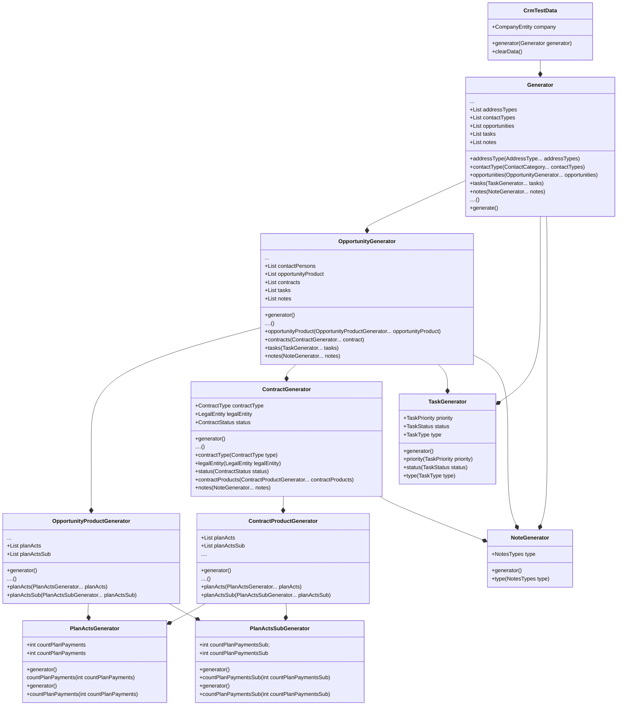

```mermaid
classDiagram
class CrmTestData{
  +CompanyEntity company
  +generator(Generator generator)
  +clearData()
}
class Generator{
  ...
  +List<AddressType> addressTypes
  +List<ContactCategory> contactTypes
  +List<OpportunityGenerator> opportunities
  +List<TaskGenerator> tasks
  +List<NoteGenerator> notes
  +addressType(AddressType... addressTypes)
  +contactType(ContactCategory... contactTypes)
  +opportunities(OpportunityGenerator... opportunities)
  +tasks(TaskGenerator... tasks)
  +notes(NoteGenerator... notes)
  ....()
  +generate()
}
class OpportunityGenerator{
  ...
  +List<Boolean> contactPersons
  +List<OpportunityProductGenerator> opportunityProduct
  +List<ContractGenerator> contracts
  +List<TaskGenerator> tasks
  +List<NoteGenerator> notes
  +generator()
  ....()
  +opportunityProduct(OpportunityProductGenerator... opportunityProduct)
  +contracts(ContractGenerator... contract)
  +tasks(TaskGenerator... tasks)
  +notes(NoteGenerator... notes)
}
class OpportunityProductGenerator{
  ...
  +List<PlanActsGenerator> planActs
  +List<PlanActsSubGenerator> planActsSub
  +generator()
  ....()
  +planActs(PlanActsGenerator... planActs)
  +planActsSub(PlanActsSubGenerator... planActsSub)
}
class PlanActsGenerator{
  +int countPlanPayments
  +generator()
  countPlanPayments(int countPlanPayments)
}
class PlanActsSubGenerator{
  +int countPlanPaymentsSub;
  +generator()
  +countPlanPaymentsSub(int countPlanPaymentsSub)
}
class ContractGenerator{
  +ContractType contractType
  +LegalEntity legalEntity
  +ContractStatus status
  +generator()
  ....()
  +contractType(ContractType type)
  +legalEntity(LegalEntity legalEntity)
  +status(ContractStatus status)
  +contractProducts(ContractProductGenerator... contractProducts)
  +notes(NoteGenerator... notes)
}
class ContractProductGenerator{
  +List<PlanActsGenerator> planActs
  +List<PlanActsSubGenerator> planActsSub
  ....
  +generator()
  ....()
  +planActs(PlanActsGenerator... planActs)
  +planActsSub(PlanActsSubGenerator... planActsSub)
}
class PlanActsGenerator{
  +int countPlanPayments
  +generator()
  +countPlanPayments(int countPlanPayments)
}
class PlanActsSubGenerator{
  +int countPlanPaymentsSub
  +generator()
  +countPlanPaymentsSub(int countPlanPaymentsSub)
}
class TaskGenerator{
  +TaskPriority priority
  +TaskStatus status
  +TaskType type
  +generator()
  +priority(TaskPriority priority)
  +status(TaskStatus status)
  +type(TaskType type)
}
class NoteGenerator {
  +NotesTypes type
  +generator()
  +type(NotesTypes type)
}

CrmTestData --* Generator
Generator --* OpportunityGenerator
OpportunityGenerator --* OpportunityProductGenerator
OpportunityProductGenerator --* PlanActsGenerator
OpportunityProductGenerator --* PlanActsSubGenerator
OpportunityGenerator --* ContractGenerator
ContractGenerator --* ContractProductGenerator
ContractProductGenerator --* PlanActsGenerator
ContractProductGenerator --* PlanActsSubGenerator
OpportunityGenerator --* TaskGenerator
OpportunityGenerator --* NoteGenerator
ContractGenerator --* NoteGenerator
Generator --* TaskGenerator
Generator --* NoteGenerator
```